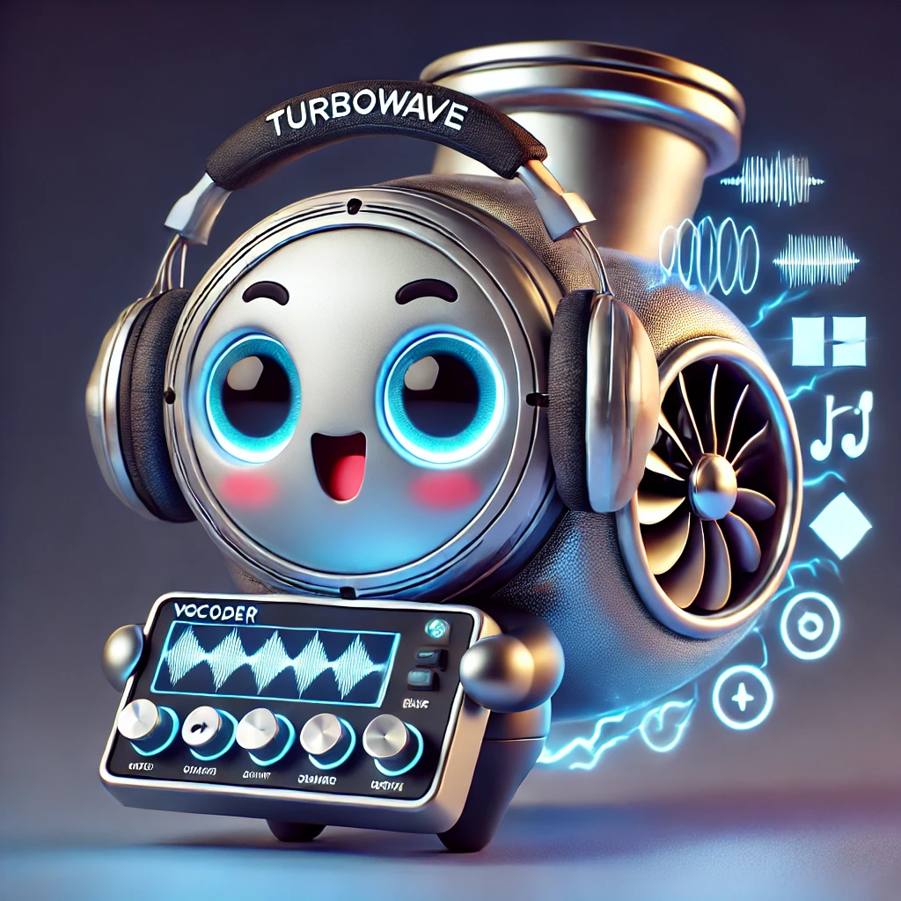

# PeriodWave: Multi-Period Flow Matching for High-Fidelity Waveform Generation <br> <sub>The official implementation of PeriodWave and PeriodWave-Turbo</sub>
<p align="center">
  
</p>

##  <a href="https://arxiv.org/abs/2408.07547"> </a>|<a href="https://arxiv.org/abs/2408.08019"> </a>|[]()|[Demo page](https://periodwave.github.io/demo/)|[Demo Page (Turbo)]( https://periodwave-turbo.github.io/audio-demo/)

**Sang-Hoon Lee<sup>1,2</sup>, Ha-Yeong Choi<sup>3</sup>, Seong-Whan Lee<sup>4</sup>**

<sup>1</sup> Department of Software and Computer Engineering, Ajou University, Suwon, Korea<br>
<sup>2</sup> Department of Artificial Intelligence, Ajou University, Suwon, Korea<br>
<sup>3</sup> Gen AI Lab, KT Corp., Seoul, Korea  <br>
<sup>4</sup> Department of Artificial Intelligence, Korea University, Seoul, Korea  <br>


This repository contains:

- 🪐 A PyTorch implementation of PeriodWave and PeriodWave-Turbo 
- ⚡️ Pre-trained PeriodWave models trained on LibriTTS (24,000 Hz, 100 bins, hop size of 256)
- 💥 Pre-trained PeriodWave models trained on LJSpeech (22,050 Hz, 80 bins, hop size of 256)
- ✨ Pre-trained PeriodWave-Encodec models trained on Universal Audio Dataset (24,000 Hz, EnCodec)
- 🛸 A PeriodWave training script

## Update

### 25.02.10
- We have released the source code and checkpoints of PeriodWave.

### 25.01.22 
- PeriodWave has been accepted to ICLR 2025.
### 24.08.16
In this repositoy, we provide a new paradigm and architecture of Neural Vocoder that enables notably fast training and achieves SOTA performance. With 10 times fewer training times, we acheived State-of-The-Art Performance on LJSpeech and LibriTTS.

First, Train the PeriodWave with conditional flow matching. 
- [PeriodWave](https://arxiv.org/abs/2408.07547): The first successful conditional flow matching waveform generator that outperforms GAN-based Neural Vocoders

Second, Accelerate the PeriodWave with adversarial flow matching optimzation. 
- [PeriodWave-Turbo](https://arxiv.org/abs/2408.08019): SOTA Few-step Generator tuned from PeriodWave
  
## Todo
### PeriodWave (Mel-spectrogram)
- [x] PeriodWave (Trained with LJSpeech, 22.05 kHz, 80 bins)
- [x] PeriodWave (Trained with LibriTTS-train-960, 24 kHz, 100 bins)
- [x] Training Code
- [x] Inference
- [x] PeriodWave with FreeU (Only Inference)
- [x] Evaluation (M-STFT, PESQ, Periodicity, V/UV F1, Pitch, UTMOS)

### PeriodWave-Turbo (Mel-spectrogram)
- [x] Paper (PeriodWave-Turbo paper was released, https://arxiv.org/abs/2408.08019.)
- [x] PeriodWave-Turbo (4 Steps ODE, Euler Method)
- [ ] Huggingface

We have compared several methods including different reconstuction losses, distillation methods, and GANs for PeriodWave-Turbo. Finetuning the PeriodWave models with fixed steps could significantly improve the performance! The PeriodWave-Turbo utilized the Multi-scale Mel-spectrogram loss and Adversarial Training (MPD, CQT-D) following BigVGAN-v2. We highly appreciate the authors of BigVGAN for their dedication to the open-source implementation. Thanks to their efforts, we were able to quickly experiment and reduce trial and error.

### PeriodWave-Turbo (EnCodec 24 kHz)  
- [x] PeriodWave-Turbo (2 Steps ODE, Euler Method)
- [x] PeriodWave-Turbo (4 Steps ODE, Euler Method)
- [ ] Huggingface

We will update the PeriodWave-Turbo Paper soon, and release the PeriodWave-Turbo models that generate waveform from EnCodec Tokens. While we trained these models with EnCodec Tokens of Q=8, we found that our model has shown robust and powerful performance on any bitrates of 1.5 (Q=2), 3 (Q=4), 6 (Q=8), 12 (Q=16), and 24 (Q=32).

## TTS with PeriodWave 
- [ ] PeriodWave for F5-TTS (24 kHz, 100 bins)
- [ ] PeriodWave-Turbo for F5-TTS (24 kHz, 100 bins)
      
The era of Mel-spectrograms is returning with advancements in models like P-Flow, VoiceBox, E2-TTS, DiTTo-TTS, ARDiT-TTS, and MELLE. PeriodWave can enhance the audio quality of your TTS models, eliminating the need to rely on codec models. Mel-spectrogram with powerful generative models has the potential to surpass neural codec language models in performance.

### 2025.04.14
Currently, we are training PeriodWave using the Mel-spectrogram from F5-TTS. By using PeriodWave instead of Vocos, we can achieve a much higher quality waveform. Please wait just a little longer, as we will release the model after fine-tuning with adversarial training in May.

## Getting Started

### Pre-requisites
0. Pytorch >=1.13 and torchaudio >= 0.13
1. Install requirements
```
pip install -r requirements.txt
```
### Prepare Dataset
2. Prepare your own Dataset (We utilized LibriTTS dataset without any preprocessing)
3. Extract Energy Min/Max 
```
#(Mel version) skip this for EnCodec version
python filelist_gen.py # val list (dev-clean and dev-other) of BigVGAN
python extract_energy.py # You can use the extracted stats (stats_libritts_24000hz, stats_lj_22050hz)
```
4. Change energy_max, energy_min in Config.json

### Train PeriodWave
```
CUDA_VISIBLE_DEVICES=0,1,2,3 python train_periodwave.py -c configs/periodwave_24000hz.json -m periodwave_test
```

### Train PeriodWave-Turbo
- Finetuning the PeriodWave with fixed steps can improve the entire performance and accelerate the inference speed (NFE 32 --> 2 or 4)
```
CUDA_VISIBLE_DEVICES=0,1,2,3 python train_periodwave_turbo.py -c configs/periodwave_turbo_24000hz.json -m periodwave_turbo
```

### Checkpoint

[Checkpoint](https://drive.google.com/drive/folders/1uUlfiSHFL9xNAZKp6-a584cW9nG7wDK7?usp=drive_link) 

- periodwave_lj_22050hz: Mel-spectrogram (80 bins)
- periodwave_lj_turbo_4: Mel-spectrogram (80 bins), 4 steps Euler 
- periodwave_libritts_24000hz: Mel-spectrogram (100 bins)
- periodwave_turbo_base: Mel-spectrogram (100 bins), 4 steps Euler 
- periodwave_turbo_large: Mel-spectrogram (100 bins), 4 steps Euler, Large Model (use inference_large.py)
- periodwave_encodec: EnCodec (24 khz), trained with libritts
- periodwave_encodec_turbo: EnCodec (24 khz), trained with libritts
- periodwave_encodec_turbo_universe_cont_step2: EnCodec (24 khz), trained with universal audio dataset, 2 steps Euler 
- periodwave_encodec_turbo_universe_mel45_from_speechonly470k: EnCodec (24 khz), trained with universal audio dataset, 4 steps Euler

### Inference PeriodWave (24 kHz)
```

# PeriodWave
CUDA_VISIBLE_DEVICES=0 python inference.py --ckpt "logs/periodwave_libritts_24000hz/G_1000000.pth" --iter 16 --noise_scale 0.667 --solver 'midpoint'

# PeriodWave with FreeU (--s_w 0.9 --b_w 1.1)
# Decreasing skip features could reduce the high-frequency noise of generated samples
# We only recommend using FreeU with PeriodWave. Note that PeriodWave-Turbe with FreeU has different aspects so we do not use FreeU with PeriodWave-Turbo. 
CUDA_VISIBLE_DEVICES=0 python inference_with_FreeU.py --ckpt "logs/periodwave_libritts_24000hz/G_1000000.pth" --iter 16 --noise_scale 0.667 --solver 'midpoint' --s_w 0.9 --b_w 1.1

# PeriodWave-Turbo-4steps (Highly Recommended)
CUDA_VISIBLE_DEVICES=0 python inference.py --ckpt "logs/periodwave_turbo_base/G_274000.pth" --iter 4 --noise_scale 1 --solver 'euler'

# PeriodWave-Turbo-L-4steps # We added additional layers for final and Mel-cond block
CUDA_VISIBLE_DEVICES=0 python inference_large.py --ckpt "logs/periodwave_turbo_large/G_379000.pth" --iter 4 --noise_scale 1 --solver 'euler'

# PeriodWave-EnCodec-4steps (Highly Recommended)
# Download the universal audio test datasets of rfwave (https://drive.google.com/file/d/1WjRRfD1yJSjEA3xfC8-635ugpLvnRK0f/view)
# periodwave_encodec_turbo_universe_mel45_from_speechonly470k model is fine-tuned from periodwave_encodec_turbo (LibriTTS only) which is fine-tuned from periodwav_encodec for efficient continual learning.

CUDA_VISIBLE_DEVICES=0 python inference_periodwave_encodec_universal_test_speech.py --ckpt "logs/periodwave_encodec_turbo_universe_mel45_from_speechonly470k/G_590000.pth" --iter 4 --noise_scale 1 --solver 'euler'
CUDA_VISIBLE_DEVICES=0 python inference_periodwave_encodec_universal_test_vocal.py --ckpt "logs/periodwave_encodec_turbo_universe_mel45_from_speechonly470k/G_590000.pth" --iter 4 --noise_scale 1 --solver 'euler'
CUDA_VISIBLE_DEVICES=0 python inference_periodwave_encodec_universal_test_sound.py --ckpt "logs/periodwave_encodec_turbo_universe_mel45_from_speechonly470k/G_590000.pth" --iter 4 --noise_scale 1 --solver 'euler'

# PeriodWave-EnCodec-2steps
CUDA_VISIBLE_DEVICES=0 python inference_periodwave_encodec_universal_test_speech.py --ckpt "logs/periodwave_encodec_turbo_universe_cont_step2/G_400000.pth" --iter 2 --noise_scale 1 --solver 'euler'
```
### Test (We will update this using huggingface or torch.hub)
```
import os
import torch
from torch.nn import functional as F
from scipy.io.wavfile import write
import utils
from meldataset_prior_length import  load_wav, MAX_WAV_VALUE
from librosa.util import normalize
from model.periodwave_encodec_freeu import FlowMatch
from encodec_feature_extractor import EncodecFeatures

ckpt = 'logs/periodwave_encodec_turbo_universe_mel45_from_speechonly470k/G_590000.pth'
hps = utils.get_hparams_from_file(os.path.join(os.path.split(ckpt)[0], 'config.json'))
device = torch.device('cuda' if torch.cuda.is_available() else 'cpu')

model = FlowMatch(hps.data.n_mel_channels,
                    hps.model.periods,
                    hps.model.noise_scale,
                    hps.model.final_dim,
                    hps.model.hidden_dim,).cuda()
_ = model.eval()
_ = utils.load_checkpoint(ckpt, model, None)
model.estimator.remove_weight_norm()

Encodec = EncodecFeatures(bandwidth=6.0).cuda() 
# 6.0 (Default, we trained the model with the feature of 6.0) 
# 1.5, 3.0, 6.0, 12.0
# 12.0 (Not used during training but our model can generate higher quality audio with 12.0)


source_path = "test/Triviul_feat._The_Fiend_-_Widow.stem.vocals_part180.wav"
audio, _ = load_wav(source_path, hps.data.sampling_rate)
audio = audio / MAX_WAV_VALUE
audio = normalize(audio) * 0.95

audio = torch.FloatTensor(audio)
audio = audio.unsqueeze(0)

audio = F.pad(audio, (0, ((audio.size(1) // 3840)+1)*3840 - audio.size(1)), 'constant')

file_name = os.path.splitext(os.path.basename(source_path))[0]
audio = audio.cuda()

with torch.no_grad():
    embs = Encodec(audio)
    resynthesis_audio = model(audio, embs, n_timesteps=4)

    if torch.abs(resynthesis_audio).max() >= 0.95:
        resynthesis_audio = (resynthesis_audio / (torch.abs(resynthesis_audio).max())) * 0.95

    resynthesis_audio = resynthesis_audio.squeeze()[:audio.shape[-1]]
    resynthesis_audio = resynthesis_audio * MAX_WAV_VALUE
    resynthesis_audio = resynthesis_audio.cpu().numpy().astype('int16')

    write("recon.wav", 24000, resynthesis_audio)
```


### If you do not want to use energy-based prior, please reduce the noise scale to 0.25

## Reference
Thanks for all great works
### Flow Matching for high-quality and efficient generative model
- FM: https://openreview.net/forum?id=PqvMRDCJT9t
- VoiceBox (Mel-spectrogram Generation): https://openreview.net/forum?id=gzCS252hCO&noteId=e2GZZfeO9g
- P-Flow (Mel-spectrogram Generation): https://openreview.net/forum?id=zNA7u7wtIN
- RF-Wave (Waveform Generation): https://github.com/bfs18/rfwave (After paper submission, we found that the paper RF-Wave also utilized FM for waveform generation. They used it on the complex spectrogram domain for efficient waveform generation. It is cool idea!)
  
### Inspired by the multi-period discriminator of HiFi-GAN, we first distillate the multi-periodic property in generator
- HiFi-GAN: https://github.com/jik876/hifi-gan

### Prior Distribution
- PriorGrad: https://github.com/microsoft/NeuralSpeech/tree/master/PriorGrad-vocoder

### Frequency-wise waveform modeling due to the limitation of high-frequency modeling
- Fre-GAN 2: https://github.com/prml-lab-speech-team/demo/tree/master/FreGAN2/code
- MBD (Multi-band Diffusion): https://github.com/facebookresearch/audiocraft
- FreGrad: https://github.com/kaistmm/fregrad

### High-efficient temporal modeling
- Vocos: https://github.com/gemelo-ai/vocos
- ConvNeXt-V2: https://github.com/facebookresearch/ConvNeXt-V2
  
### Large-scale Universal Vocoder
- BigVGAN: https://arxiv.org/abs/2206.04658
- BigVSAN: https://github.com/sony/bigvsan
